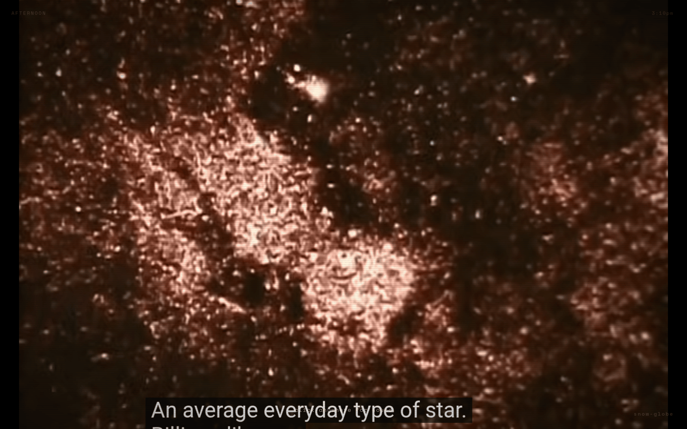

# snow-globe ❄

A personal internet TV station. You don't choose — that's the point.

Curated YouTube playlists, time-synced so everyone watching sees the same thing. Adult Swim-style bump cards between videos. Different programming by time of day. Reshuffled daily. No algorithm, no recommendations, no feed. Just television.

**Live at [tv.brezgis.com](https://tv.brezgis.com).**



## The idea

Everything is separate now. You scroll alone, you choose alone, your feed is yours and nobody else's. snow-globe is a tiny act of resistance: a shared broadcast where you tune in and watch whatever's on, like we used to.

The playlist is deterministic and keyed to the clock. No server, no streaming — just math. If you and a stranger both open the page at 10:47 PM on a Tuesday, you're watching the same video at the same timestamp.

## Schedule

| Block | Hours | Vibe | What's on |
|-------|-------|------|-----------|
| 🌑 Dead Hours | 2–8 AM | Ambient | NRK-style slow TV trains, a seven-hour London canal, the Apollo 11 moonwalk, Pages from Ceefax, rain at night |
| ☀️ Morning | 8 AM–12 PM | Gentle | People making things (Haanstra's *Glas*, *Chairmaker*, Shoji Hamada, bookbinding), Painlevé, Zoo Quest, Mister Rogers, Rambalac walks |
| 🌤️ Afternoon | 12–6 PM | Interesting | James Burke's Connections, Bell Labs & AT&T Archives, BBC Open University, Eames, Kievnauchfilm |
| 🌆 Evening | 6–10 PM | Curated gems | Feynman, Sagan, Alan Watts, *Disappearing World*, Les Blank, Herzog, Nina Simone, Coltrane, Alice Coltrane, Monk, a few Tiny Desks |
| 🌙 Late Night | 10 PM–2 AM | Strange & beautiful | Chris Marker, Švankmajer, Maya Deren, Brakhage, Fischinger, McLaren, Norstein, Zagreb Film, Nam June Paik, vintage Sesame Street |

**137 videos. 80+ hours of content.** Reshuffled daily — same videos, new order each day. Durations are exact (checked against YouTube), because the whole schedule is computed from them.

## Quickstart

Pure static site — no build step, no dependencies. It just needs a local server (the YouTube embed API doesn't like `file://`):

```bash
git clone https://github.com/brezgis/snow-globe.git
cd snow-globe
python3 -m http.server 8765
# open http://localhost:8765
```

## Curation philosophy

**Primary sources over commentary.** The Feynman lecture itself, not a video essay about Feynman. The Švankmajer film, not a YouTuber explaining Švankmajer. The actual 1953 Bell Labs transistor documentary, not a retrospective about it.

**Things you'd never search for.** The best things you'll ever see are things you didn't look for. snow-globe is what happens when someone with taste just leaves the TV on and you walk into the room.

**Short pieces welcome.** A 45-second Sesame Street typewriter animation belongs next to a 28-minute Chris Marker film. The variety is the point.

## How it works

```
┌──────────────────────────────────────────┐
│  Browser opens snow-globe                │
│  ↓                                       │
│  What time is it? → Pick time block      │
│  ↓                                       │
│  Shuffle playlist (seeded by today's     │
│  date — deterministic, same for everyone)│
│  ↓                                       │
│  Calculate position in playlist from     │
│  elapsed seconds since block start       │
│  ↓                                       │
│  Load YouTube video, seek to exact spot  │
│  ↓                                       │
│  Between videos: show bump card          │
│  (black screen, white text, 12 seconds)  │
│  ↓                                       │
│  Repeat                                  │
└──────────────────────────────────────────┘
```

No backend. No database. No streaming server. Pure static site — HTML, CSS, JS, and JSON playlist files. The "server" is the clock.

## Bumps

12-second interstitials between videos, in the spirit of Adult Swim bumps. There are 22 of them in `bumps.js`, all drawn live in the browser with their sound synthesized on the spot, and most re-roll their script each time. Among them: a snow globe that gets shaken, an inkblot that is always a moth, sheep being counted from somewhere in the thousands, a fish that eats the sentence, viewer mail, the Emergency Feelings System, the forecast for your apartment, light travelling to the moon in real time, rule 30, and plain text cards drawn from `bumps.json` (time-aware, with a pool per block).

Watch them all in the **bump reel** at [`/bumps.html`](https://tv.brezgis.com/bumps.html) (play all, shuffle, re-roll, fullscreen). From the channel, it's hidden: open the snow-guide and click its logo three times. On the channel itself, preview one with `/#bump=sheep`, or run `testBump('sheep', 30)` in the console (`listBumps()` lists them).

The **snow-guide** button (bottom left) lifts a printed program guide over the video: the real schedule for the rest of this block and the next two.

> *"you're watching a website pretend to be a TV. we're both okay with this."*
>
> *"nobody chose this. that's the point."*
>
> *"it's 2:47 AM. this stays between us."*
>
> *"the best things you'll ever see are things you didn't search for."*

## File structure

```
snow-globe/
├── index.html              # The page
├── style.css               # CRT aesthetic, scanlines, vignette
├── app.js                  # Schedule logic, YouTube player, bumps
├── bumps.js                # The bump library: 22 animated, self-scoring bumps
├── bumps.json              # Text-card pools (general + per-block)
├── playlists/
│   ├── morning.json        # ☀️ Nature, cooking, crafts
│   ├── afternoon.json      # 🌤️ Docs, essays, educational
│   ├── evening.json        # 🌆 Lectures, music, concerts
│   ├── latenight.json      # 🌙 Art films, animation, weird
│   └── deadhours.json      # 🌑 Ambient, slow TV, rain
├── tv-guide.py             # Generates daily TV Guide schedule
├── content-ideas.md        # Brainstorm list for future content
├── video-curation.md       # Curated video notes with sources
└── README.md
```

## Adding videos

Edit the JSON files in `playlists/`. Each entry:

```json
{ "id": "dQw4w9WgXcQ", "title": "Something Familiar", "duration": 212 }
```

- `id` — YouTube video ID (from the URL after `v=`)
- `title` — Human-readable title
- `duration` — Length in seconds

### Verify before adding

Check if a video is embeddable:
```bash
curl -s -o /dev/null -w "%{http_code}" \
  "https://www.youtube.com/oembed?url=https://www.youtube.com/watch?v=VIDEO_ID&format=json"
# 200 = good, 401/404 = dead or not embeddable
```

## Deploy

Push to GitHub Pages or drop on any static file server. No build step, no dependencies, no framework.

```bash
# GitHub Pages: just push to a repo with Pages enabled
git push origin main
```

## TV Guide

`tv-guide.py` generates a daily schedule showing what's playing when. Matches the same shuffle algorithm as the web app.

```bash
python3 tv-guide.py
```

## Built with

- YouTube IFrame API
- CSS (scanlines, vignette, CRT glow)
- Space Mono + Inter (fonts)
- A clock
- Taste

---

*the signal is the show.*
